<div align="center">
  
</div>

# Seja bem vindo ao Orçamento Simples 👋

Uma ferramenta simples e produtiva desenvolvida para ser o seu aliado, e ajudar a gerenciar melhor suas finanças pessoais de forma prática e conveniente!

<div align="left">
  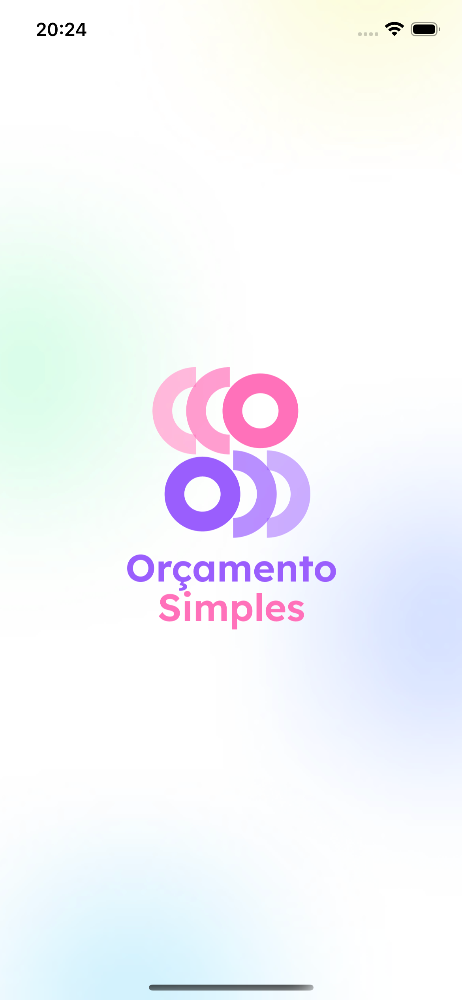
  
  
  
  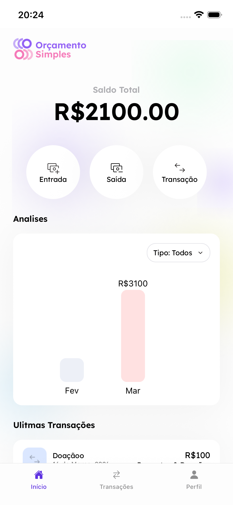
</div>
<div align="left">
  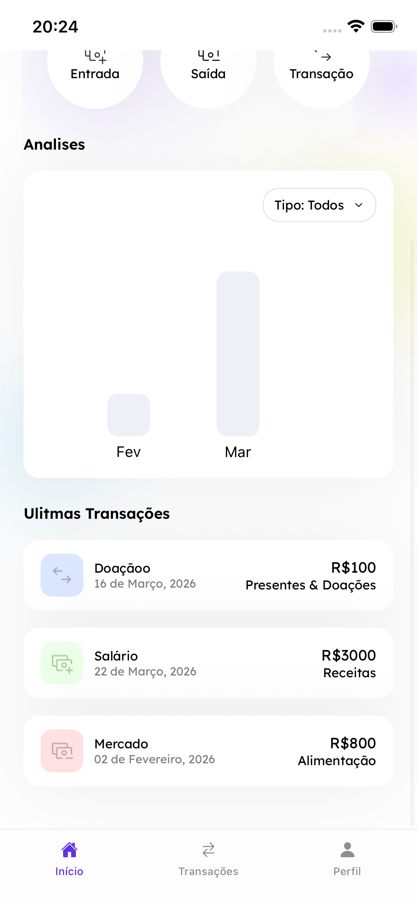
  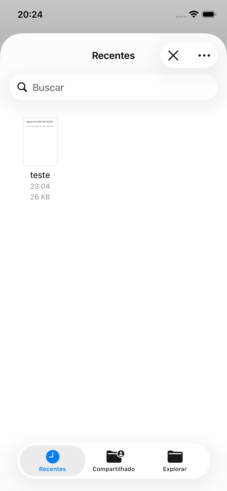
  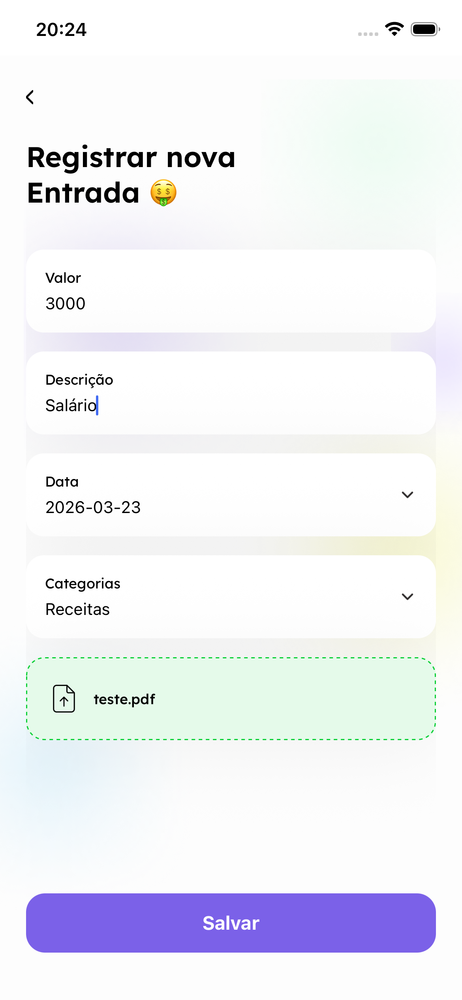
  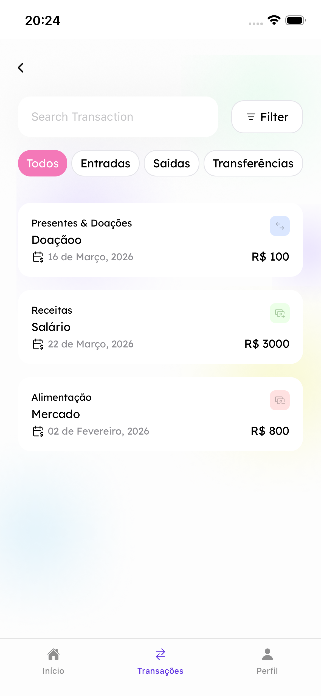
  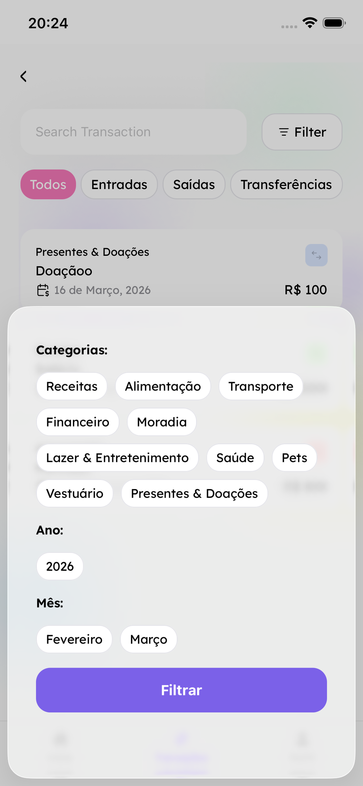
</div>
<div align="left">
  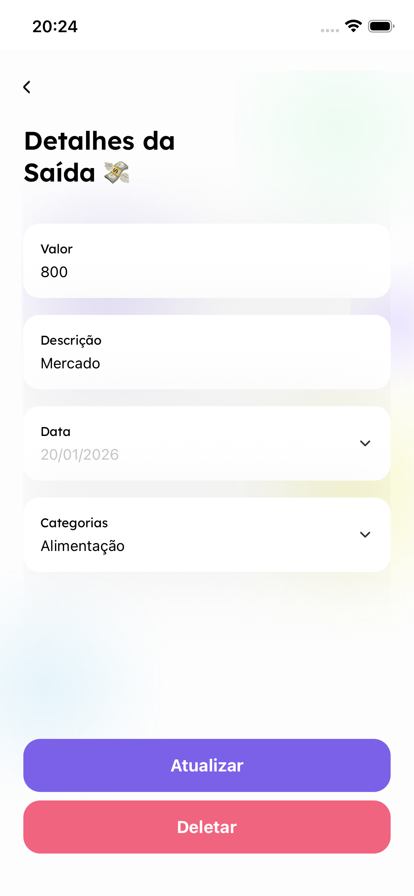
  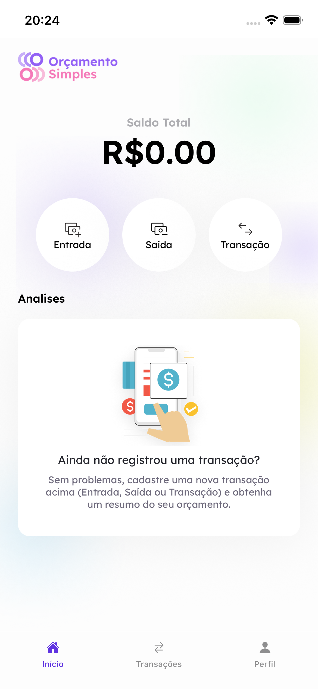
  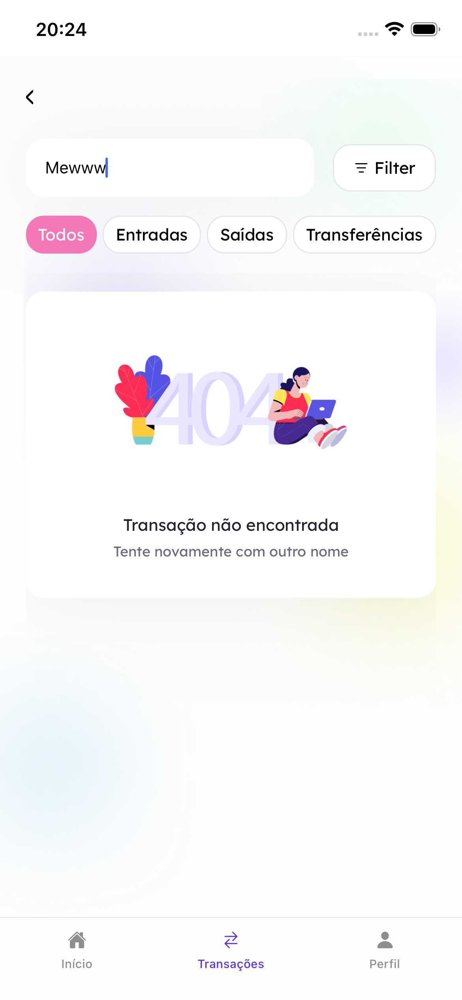
  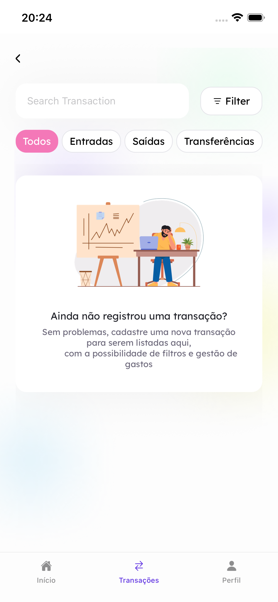
  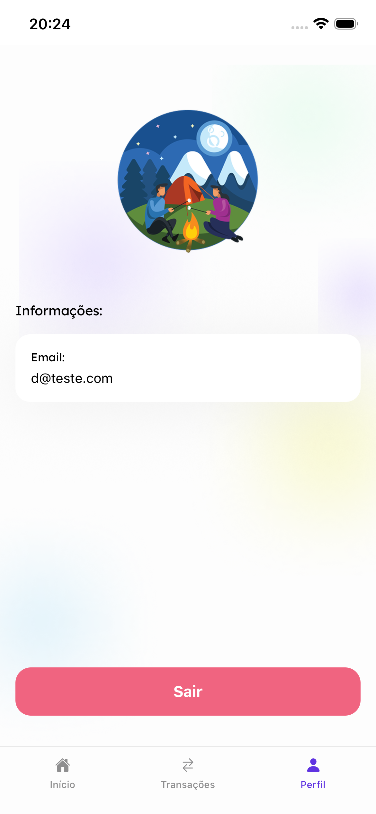
</div>

---
### Links:
- **Repo**: https://github.com/paoru5444/tech-challenge-fase-3
- **Figma**: https://www.figma.com/design/UcuHjUu120gHwTIFDZBrV5/Or%C3%A7amento-Simples?node-id=0-1&t=y2hudG4BATBZr4KK-1
---

## Como começar


1. Instale as dependências
```bash
   npm install
```

1. Faça um Pré Build
```bash
   npx expo prebuild --clean
```

2. Inicie o app
```bash
   npx expo start
```

Na saída do terminal, você encontrará opções para abrir o app em:

- [Build de desenvolvimento](https://docs.expo.dev/develop/development-builds/introduction/)
- [Emulador Android](https://docs.expo.dev/workflow/android-studio-emulator/)
- [Simulador iOS](https://docs.expo.dev/workflow/ios-simulator/)
- [Expo Go](https://expo.dev/go), uma sandbox limitada para experimentar o desenvolvimento com Expo

Você pode começar a desenvolver editando os arquivos dentro do diretório **app**. Este projeto utiliza [roteamento baseado em arquivos](https://docs.expo.dev/router/introduction).

---

### Sobre o upload de arquivos no dispositivo android:

- A configuração do firebase usando o web ensinado em aula causa problemas quando o update acontece no android, aparentemente, o android bloqueia o fetch sob arquivos do dispositivo por questões de segurança, impossibilitando a geração de um blob para passar ao firebase no upload. Para a continuidade do projeto, vou migrar para o react-native-firebase, que lida melhor com esas questões de arquivos locais.

---

## Ferramentas

- React Native
- Typescript
- Expo
- Firebase
- Zod
- React Hook Form
- Formik
- Expo Router
- Expo Font
- React Native Calendars
- React Native Document Picker

---

## Arquitetura

O projeto foi construído com uma arquitetura **modular**, onde cada pasta dentro de `screens/` representa um módulo independente da aplicação.

### Padrão de cada módulo

Cada módulo segue o mesmo padrão de escrita, separando responsabilidades entre dois tipos de componentes:

- **Stateful Components** (`screens/`) — gerenciam a lógica de negócio e o estado
- **Stateless Components** (`components/`) — apenas renderizam os dados recebidos via props

Essa separação torna os componentes **fáceis de testar** de forma isolada, uma vez que os Stateless Components recebem seus dados por injeção de dependência.

### Estrutura de pastas
```
src/
└── screens/
    └── <ModuleName>/
        ├── components/    # Stateless components (apenas renderização)
        ├── screens/       # Stateful components (lógica e estado)
        ├── context/       # Context API do módulo
        ├── models/        # Tipagens e interfaces
        ├── navigation/    # Configuração de navegação
        ├── constants/     # Constantes do módulo
        ├── utils/         # Funções utilitárias
        └── store/         # (em breve) Gerenciamento de estado global
```

### Escalabilidade

Essa estrutura torna o projeto preparado para crescer, seja para a adição de **novas features** ou para a inclusão de **novos integrantes** na equipe de desenvolvimento, sem que a organização do código seja comprometida.

---

## Melhorias

- Aprimorar a tipagem dos módulos em toda a aplicação
- Separar os hooks em 2 domínios (Lógica e Serviço)
- Criar dominio de serviço genérico para o firebase
- Salvar os assets no S3 da AWS
- Adicionar mais animações e selecionar icones melhores
- Adicionar ferramenta de gerenciamento de estado global mais robusta (Redux)
- Criar testes unitários visando 80% de coverage
- Criar em torno de 5 testes de integração para cenários criticos
- Adicionar ferramenta de Tracking e Monitoramento como o Sentry
- Subir a aplicação no Google Play e na App Store
- Adicionar EAS para OTA Updates
- Usar react-native-firebase

---

- Desenvolvido com o ❤️
